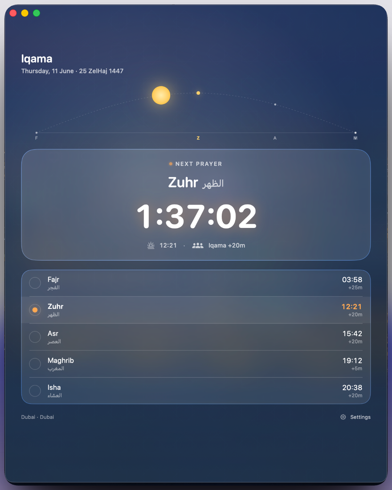
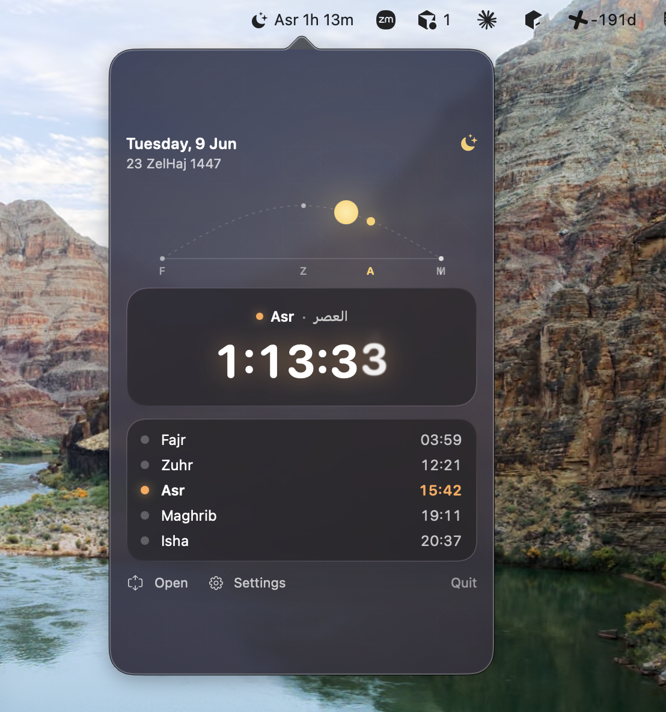
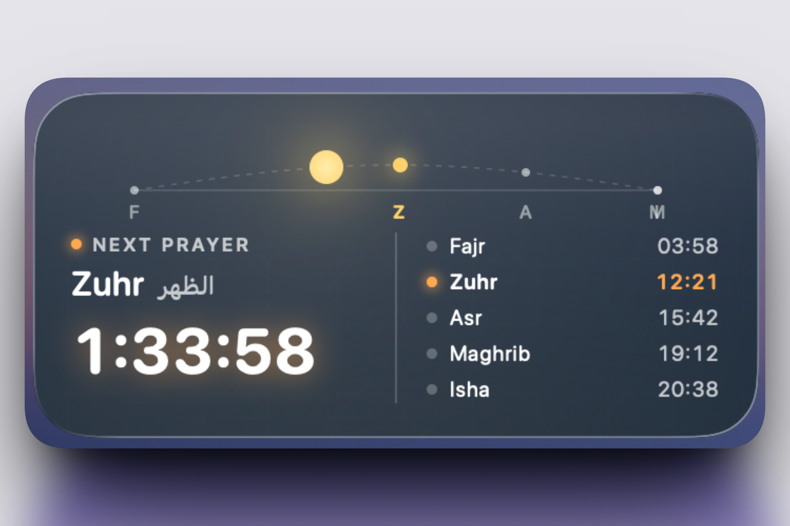

# Iqama

A native macOS prayer-times app with a celestial-themed Liquid Glass UI, a menu-bar countdown, and matching home-screen widgets. **Location-aware**: it shows prayer times for wherever you are.

- **Inside the UAE** → official **Awqaf** (UAE General Authority of Islamic Affairs & Endowments) static data, bundled for all **7 emirates** — no network required.
- **Anywhere else** → the free **[Aladhan](https://aladhan.com/prayer-times-api)** API, fetched and cached, with a configurable calculation method.

Location is auto-detected on first launch (nearest emirate in the UAE, your city elsewhere) and can be set manually in Settings. Iqama offsets default to the official Awqaf values and can be overridden per-prayer.

<p align="center">
  
</p>

## Highlights

- **Location-aware** — auto-detects your location (CoreLocation) and routes to Awqaf inside the UAE or Aladhan elsewhere; pick a UAE emirate, or any city/country, manually in Settings. Denied location? It falls back to Dubai so the app is never empty.
- **Celestial Hours** theme — the background gradient shifts smoothly through the day; a glowing sun (or moon at night) traces a real solar arc across the top of the window, with ticks for Fajr · Zuhr · Asr · Maghrib · Isha at their actual local times.
- **Liquid Glass everywhere** — countdown card, prayer rail, and chip strip use the macOS 26 Tahoe `.glassEffect` material with `.interactive()` specular highlights and a `GlassEffectContainer` for fluid morph animations. The window is non-opaque so the desktop wallpaper blurs through it.
- **Menu-bar status item** — at-a-glance "next prayer + countdown" right in the menu bar; click to drop a full popover.
- **Widget extension** — small / medium / large widgets that mirror the main app's design, including the live sky arc.
- **Configurable iqama & calculation** — override the iqama offset for each prayer, pick the Aladhan calculation method (or leave it on "Auto by country"), toggle reminders, and choose the notification lead time — all from a real Settings panel.
- **In-app auto-update** — checks GitHub Releases on launch and once a day; when a newer version is published, a banner offers a one-click update that downloads the DMG, verifies it's our notarized build, swaps the app bundle, and relaunches — no manual re-download.
- **Notarized & stapled** — distributed DMG is signed with a Developer ID Application certificate and notarized by Apple, so it opens cleanly on any Mac without Gatekeeper warnings.

## Screenshots

### Main window

<p align="center">
  
</p>

The sky-arc band tracks the sun/moon across the day; the active prayer's tick glows. Below it, a glass countdown card and prayer rail with bilingual labels (English + Arabic) and per-prayer iqama offsets.

### Menu-bar popover

<p align="center">
  
</p>

Same theme scaled down — note the live countdown next to the moon icon in the system menu bar (`Asr 1h 13m`).

### Widget

<p align="center">
  
</p>

Medium widget on the desktop showing the sky arc, the next prayer name in Arabic + English, the countdown, and a quick rail of today's times.

## Install

1. Download the latest DMG from the [Releases page](https://github.com/tamtom/iqama/releases/latest).
2. Open the DMG and drag **Iqama** into your **Applications** folder.
3. Launch from Spotlight or Launchpad. The first launch asks for notification permission (iqama reminders) and location permission (to find your nearest emirate / city — you can also set it manually in Settings).

After this first install, the app keeps itself up to date — future versions are offered in-app with a one-click update (see below).

Optional: open the **Widget Gallery** (right-click the desktop → Edit Widgets) to add one of the three widget sizes.

## Build from source

Requires **Xcode 26+** running on **macOS 26 Tahoe** (the app uses Liquid Glass APIs).

```bash
git clone https://github.com/tamtom/iqama.git
cd iqama
open "Dubai iqama.xcodeproj"
```

Build the `Dubai iqama` scheme. The first time you build, Xcode will sign with your personal team for local-only execution; the **Release** configuration is wired to sign with a Developer ID Application certificate for distribution.

## Release pipeline

`Scripts/release.sh` produces a fully notarized, stapled DMG ready to attach to a GitHub release:

1. `xcodebuild archive` (Release, Developer ID, hardened runtime)
2. `xcodebuild -exportArchive` with `developer-id` (strips Debug entitlements, adds secure timestamp)
3. Zip the `.app` → `xcrun notarytool submit --wait` → `xcrun stapler staple`
4. Build a DMG containing the stapled app → submit it for its own notarization → staple it too

One-time setup of the notarization credential (stored in your login keychain, **never** in the repo):

```bash
xcrun notarytool store-credentials "DubaiIqamaNotary" \
    --apple-id "your-apple-id@example.com" \
    --team-id "W5THJP5XXD" \
    --password "app-specific-password-from-appleid.apple.com"
```

Then:

```bash
./Scripts/release.sh
```

An `Iqama-<version>.dmg` lands on your Desktop. `spctl --assess` reports `accepted` with `source=Notarized Developer ID`.

## Updates

`UpdateChecker` polls `https://api.github.com/repos/tamtom/iqama/releases/latest` on launch and every 24 h, comparing the published tag to the running `CFBundleShortVersionString`. When a newer version exists, `ContentView` shows an `UpdateBanner`.

Pressing **Update** hands off to `UpdateInstaller`, which:

1. Downloads the release's `.dmg` asset (with progress).
2. Mounts it and **verifies** the app inside — `codesign --verify --deep --strict`, `spctl --assess` (notarization), and a Team ID match against `W5THJP5XXD`. Anything that fails verification is refused.
3. Stages a copy, unmounts, then runs a detached helper that waits for the app to quit, atomically swaps the bundle in `/Applications`, clears quarantine, and relaunches the new version.

Because self-updating requires writing to `/Applications` and spawning a helper, the **main app is not sandboxed** (it ships via Developer ID, not the App Store). The **widget extension stays sandboxed**, as macOS requires.

## Architecture

- **Main app target** — SwiftUI window + status bar `NSPopover` hosted from `AppDelegate`. `CountdownManager` ticks on a `Timer` and publishes `CountdownSnapshot`s; views observe via `@StateObject`. `UpdateChecker` + `UpdateInstaller` provide the self-update flow.
- **Data sources** — `PrayerTimesService` is a thin facade over a `PrayerDataProvider`: `BundledAwqafProvider` (reads the bundled per-emirate JSON) inside the UAE, or `AladhanProvider` (reads cached Aladhan month data) elsewhere. `LocationManager` resolves the place and writes it to settings; `AladhanSync` (main app only) fetches + caches non-UAE months. Downstream callers (`CountdownManager`, the widget, the views) are unchanged — only the source underneath swaps.
- **Widget extension** — `WidgetKit` timeline provider builds entries at each prayer transition. Shares the model/service/UI code and the prayer-times folder with the app via symlinks. UAE data is bundled into the widget; non-UAE live data is read from a shared **App Group** container (an opt-in capability — see below).
- **Prayer data** — per-emirate monthly JSON under `Dubai iqama/prayer_times_2026/<emirate>/` (Abu Dhabi · Dubai · Sharjah · Ajman · Umm Al Quwain · Ras Al Khaimah · Fujairah), full year 2026 from the Awqaf API. Each file carries the azan settings (iqama offsets) and per-day Gregorian + Hijri dates and prayer times. The bundled folder is treated as a **folder reference** (`explicitFolders`) so the tree is preserved in the app and widget bundles.
- **Theme** — `Shared/UI/Theme.swift` interpolates a 12-keyframe palette through the day; `CelestialBackground.swift` composes the gradient + 8-point-star ornament + drifting starlight; `SkyArc.swift` draws the half-ellipse + prayer ticks + sun/moon disc; `WindowBackdrop.swift` is an `NSViewRepresentable` that makes the window non-opaque so the desktop wallpaper blurs through.

## Data sources & accuracy

- **UAE** — official times from [Awqaf](https://www.awqaf.gov.ae) for all 7 emirate capitals, bundled with the app for 2026. No API calls happen at runtime. `Scripts/` regenerates this data from the Awqaf API.
- **Outside the UAE** — the free [Aladhan API](https://aladhan.com/prayer-times-api). The main app fetches the current + next month and caches them, so the app works offline after the first fetch. The calculation method auto-picks per country (e.g. Umm al-Qura for KSA, ISNA for North America, MWL elsewhere) and is overridable in Settings.

### Enabling non-UAE widgets (App Group)

The app and the sandboxed widget share non-UAE cache via an **App Group**. UAE widgets work out of the box; to let widgets show **non-UAE** live data, enable the capability once:

1. In Xcode → the **Dubai iqama** target → **Signing & Capabilities** → **+ Capability → App Groups**, and check `group.com.tamimi.shared.Dubai-iqama` (ready-made entitlement files are in the repo). Do the same for the **widgetExtension** target.
2. Build/run once so Xcode registers the group (a development-signed Mac is required).

Without this, the main window and menu-bar countdown still show non-UAE times correctly — only the widget falls back to the bundled UAE data.

## License

See [LICENSE](LICENSE) if present, otherwise all rights reserved.
